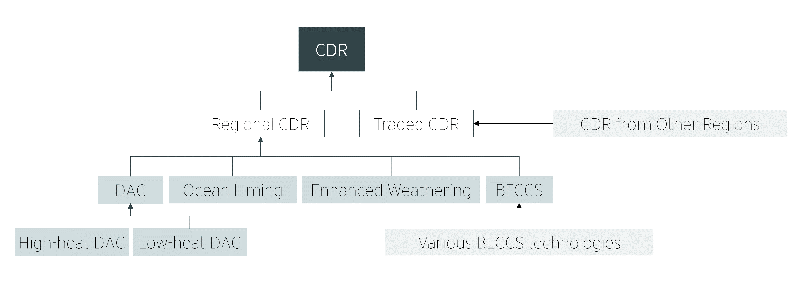

# Overview of the CDR Sector

The CDR sector supplies carbon dioxide removal (CDR) in [GCAM-CDR](./README.md). It is created by the `CDR.xml` file.

## Overview

The structure of the CDR sector, shown in Figure 1, enables modular extension to include features like [trade in CDR](./CDR_policies#trade-in-CDR) and [constraints on the growth of CDR output](./configuring_GCAM-CDR#controlling-the-growth-of-CDR).

*Figure 1. The CDR sector includes two layers, which makes it possible to extend the sector by including additional files.*

### CDR Supply Sector 

The top-level sector is called `CDR`. This is level at which [final demand for CDR](./CDR_policies.md) is defined in each region.

### CDR_regional Supply Sector

Just below the `CDR` supply sector is the `CDR_regional` sector, which manages CDR produced within a single geopolitical region. When trade in CDR is disabled, the `CDR` sector draws its inputs directly from the `CDR_regional` sector. When trade is enabled, as it is by default, `CDR` in each region draws on the `CDR_traded` sector in `USA`, which draws on the `CDR_regional` sectors in each region.

By default, the `CDR_regional` supply sector has just one subsector, `CDR`, which contains separate technologies for BECCS, DAC, OEW, and TEW.[^1]  This is where those technologies compete with one another. The optional `growth_limit` files add an extra subsector, `unsatisfiedCDRdemand`, which contains a placeholder technology that can "capture" demand for CDR without actually removing any carbon. By controlling how much of the demand for `CDR_regional` is allocated to the `unsatisfiedCDRdemand` subsector, the model can ensure that the CDR sector does not grow at an unrealistic rate. See the documentation on [controlling the growth of CDR output](./configuring_GCAM-CDR#controlling-the-growth-of-CDR) for details.

## Technical remarks on implementation
The configuration of the `CDR_regional` sector and its technologies also provides some more technical benefits for the model.

- The `DAC`, `OEW`, and `TEW` technologies in this sector take `atmospheric_CO2`  as inputs. Since `atmospheric_CO2` has a negative carbon coefficient, this is where negative emissions occur for those technologies. This way we can handle the negative emissions consistently and in one place, rather than adding it to each technology, which would require the creation of alternative carbon storage markets for technologies that do not use geological carbon storage. This makes it easier to manage negative emissions through targeted policies.
- A related benefit is that these technologies include a `<CO2 name="CO2_CDR"/>` tag, whereas the technologies in the DAC, OEW, and TEW technologies use the standard `<CO2 name="CO2"/>` tag. The negative emissions from the technologies in `CDR_regional` are therefore disconnected from the price on `CO2` and accounted for separately from any process emissions. Normally, this makes carbon accounting and pricing much easier. 
	- Note, though, that **if you want to count negative emissions from these DAC, OEW, and TEW toward the main carbon constraint**, you will need to set up a linked policy to connect the `CO2_CDR` market to the `CO2` market. If you do this, it is strongly recommended that you set the `price-adjust` parameter to 0 to avoid distorting competition between those technologies and BECCS.  

\[[return to GCAM-CDR overview](./README.md)\]

### Notes
[^1]: The BECCS technology is added by the `BECCS_integration.xml` file. 
