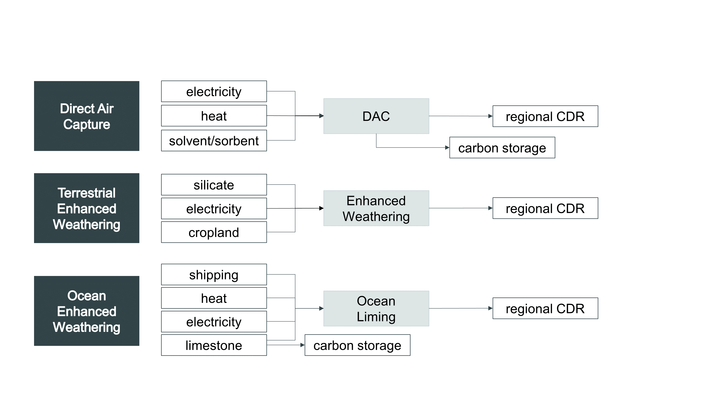

# New CDR Technologies in GCAM-CDR

[GCAM-CDR 1.0](./README.md) adds three kinds of engineered carbon dioxide removal (CDR) to GCAM: direct air capture (DAC), ocean alkalinization or ocean enhanced weathering (OEW), and terrestrial enhanced weathering (TEW). The implementation of DAC differs somewhat from the implementation included in GCAM 5.4. This page describes these technologies, as implemented in  GCAM-CDR, and explains how to configure them.

For instructions on including these technologies in a scenario, see the documentation on [Configuring GCAM-CDR](./configuring_GCAM-CDR.md).

*Fig. 1. Schematic representations of the new CDR technologies in GCAM-CDR.*

## Direct Air Capture

GCAM-CDR includes two kinds of DAC: a high-heat, liquid solvent-based technology similar to the one developed by Carbon Engineering, and a low-heat, solid sorbent-based technology similar to the one developed by Climeworks.

### High-Heat, Liquid Solvent-Based DAC

GCAM-CDR represents a high-heat, liquid solvent-based approach to DAC, similar to  the one developed by Carbon Engineering and described in (Keith et al. 2019). In our implementation, this technology takes natural gas and electricity as its main inputs and sends captured CO2 to regional carbon storage markets, which allocate it to onshore or offshore geological storage. We assume an oxy-fired calciner that simultaneously captures atmospheric CO2 and 100% of the emissions from the natural gas, sequestering both together.

This technology very closely resembles one of the DAC technologies introduced in GCAM 5.4, which is described in (Fuhrman et al. 2019).

### Low-Heat, Solid Sorbent-Based DAC

GCAM-CDR represents a low-heat, solid sorbent-based approach to DAC, similar to the one developed by Climeworks and described in (Wurzbacher et al. 2016) and (McQueen et al. 2020). In our implementation, this technology takes waste heat and electricity as its main inputs and sends captured CO2 to the carbon storage market, which allocates it to onshore or offshore geological storage. The waste heat is modeled endogenously as a byproduct of thermal power plants and industrial energy use. This means that the availability of waste heat to power sorbent-based DAC is limited in GCAM-CDR.

This technology loosely resembles one of the other DACCS technologies introduced in GCAM 5.4, but differs in that the GCAM-CDR version uses waste heat from other processes whereas the GCAM 5.4 version uses on-site process heat from natural gas.

## Ocean Enhanced Weathering

GCAM-CDR includes only one kind of OEW: ocean liming. The implementation in GCAM-CDR is based on a technology described in (Renforth et al. 2013). Ocean liming involves depositing lime into the open ocean, where it begins a short cascade of inorganic chemical reactions that lead to the ocean absorbing more CO2 from the air while simultaneously counteracting ocean acidification. Because of the modularity of the alkalinity calculations in GCAM’s climate module, Hector, the beneficial effects of ocean liming on ocean alkalinity are not explicitly modeled in GCAM-CDR 1.0 or Hector.

In GCAM-CDR, ocean liming takes natural gas, limestone, electricity, and a derivative of international shipping as inputs. We assume an oxy-flash calcination process, as described in (Renforth et al. 2013), that captures and sequesters 100% of the emissions from both burning natural gas and calcining limestone and then sends the captured CO2 to geological storage.

The derivative of international shipping is parameterized on the assumption that lime would be spread from commercial cargo ships rather than a separate, purpose-built fleet. Following Caserini et al. (2019), we assume that ocean liming cannot use more than 13% of global shipping capacity, although total shipping volume does increase endogenously in response to demand from the ocean liming industry. This constraint is implemented as a (modified) fractional secondary output from the international shipping technology, where the supply curve scales endogenously with the cost of shipping. Some OEW shipping capacity is available well below the cost of shipping to reflect the fact that many cargo ships often sail empty or carrying cargo at a steep discount (Brancaccio et al. 2017). As demand approaches that 13% limit, costs rise toward and then surpass the average cost of shipping, eventually imposing a limit on the amount of CDR that can be accomplished via OEW.

## Terrestrial Enhanced Weathering

GCAM-CDR includes only one kind of TEW: spreading crushed basalt on cropland. This is similar to the approach described in (Beerling et al. 2020). The default implementation of this technology takes basalt and electricity as inputs, as well as an abstract input called “cropland.” The cropland input represents the limited supply of agricultural land on which to spread basalt, and it exhibits an upward-sloping supply curve to represent the increasing marginal cost of applying basalt to less accessible areas. The CO2 captured through TEW is assumed to be stored mainly in bicarbonate and carbonate minerals, but these are not explicitly modeled; removals are modeled simply as negative CO2 emissions. 

GCAM-CDR also includes an alternative implementation that models basalt not as a standalone CDR technology, but as a type of fertilizer, based on studies suggesting that crushed basalt can increase agricultural yields (Nunes et al. 2014, Edwards et al. 2017, Beerling et al. 2020, Kelland et al. 2020). In this implementation, terrestrial enhanced weathering is excluded from the CDR sector and moved instead to the fertilizer sector. It operates as a partial substitute for nitrogen fertilizer, resulting in a mix of nitrogen fertilizer and basalt being applied to croplands. The modeled rate of application follows the experiment in (Kelland et al. 2020), in which yield increases from basalt application approximately match the boost provided by nitrogen fertilizer in GCAM. In this implementation, endogenous limits on terrestrial enhanced weathering arise from the endogenous limits on fertilizer demand, which are based on the area of land under cultivation, demand for food, crop prices, etc. Further constraints arise from exogenously specified limits on the share of fertilizer demand that can be satisfied by the application of basalt.

The default implementation of TEW as a standalone CDR technology ignores the fertilization effects of basalt because the magnitude of that effect is still relatively unknown, having been documented only in a few case studies. We include the alternative implementation anyway to help users explore the agricultural and carbon implications of using basalt as a substitute for synthetic fertilizer, but users should recognize the large uncertainties around that fertilization effect, the rate of substitution between basalt and synthetic fertilizer, and the rate of uptake by farmers.

## Technical Notes on Implementation

The negative emissions for all of these technologies are accomplished via an `atmospheric CO2` input in the `CDR_regional` supply sector, and not in the technologies themselves. The `atmospheric CO2` input has a `PrimaryFuelCO2Coef` of `-1`, and so GCAM sees its use as removing CO2 from the atmosphere. The solvent and sorbent inputs to DAC technologies have a `PrimaryFuelCO2Coef` of `1` so that those technologies have "captured" CO2 to send to the carbon storage market, but this has no effect on atmospheric carbon levels. This is more convoluted than the `airCO2` approach used by the DAC technologies in GCAM 5.4. GCAM-CDR takes this more complicated approach so that the negative emissions for DAC are accomplished in the same way as for OEW and TEW, which do not use the carbon storage market.

\[[return to GCAM-CDR overview](./README.md)\]
